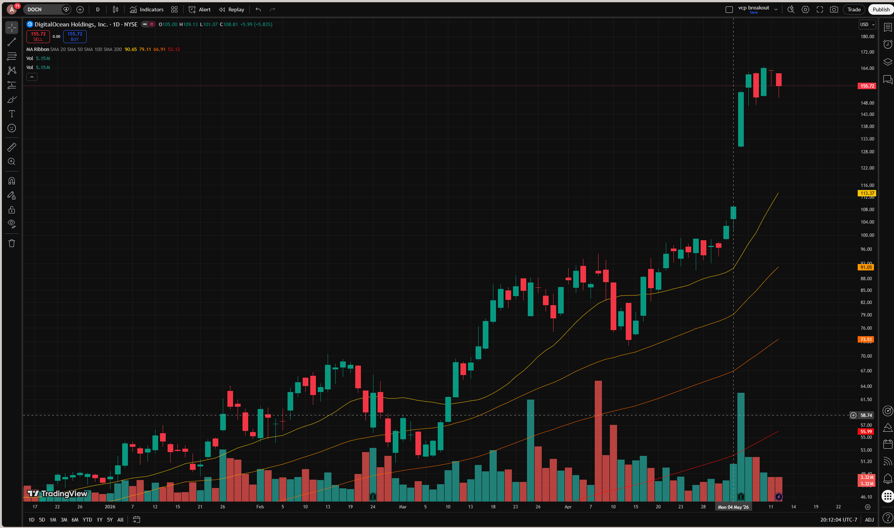
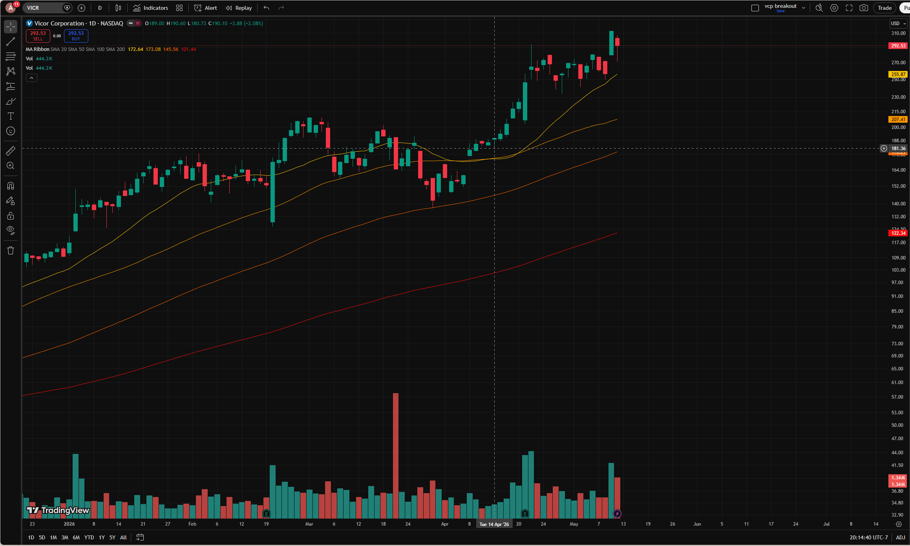
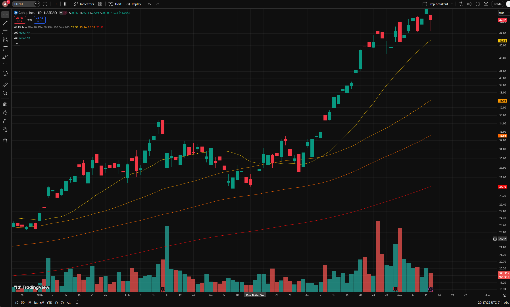

# VCP / SEPA Trade Examples — Minervini Method

A collection of real chart analyses applying Mark Minervini's SEPA (Specific Entry Point Analysis) and Volatility Contraction Pattern (VCP) methodology.

---

## Example 1: DOCN (DigitalOcean Holdings) — May 2026

### Question
Was the VCP entry on May 4, 2026?

### Price Context
- 52-week range: $25.56 – $164.77
- MACD turned positive: April 21, 2026
- Momentum Indicator crossed above 0: April 20, 2026
- DOCN broke above its upper Bollinger Band: **May 4, 2026**
- Q1 2026 earnings (blowout beat) released: May 5, 2026
- Stock exploded +5.38% on May 6, with heavy volume
- All-time high of $164.77 reached: May 8, 2026
- Stock up ~64% over the 2 weeks ending May 11

### VCP Analysis

| VCP Element | Observation |
|---|---|
| Prior uptrend (Stage 2) | Yes — stock had been recovering from $25 lows |
| Contracting corrections | Forming through late March – late April |
| Volume dry-up | Volume declining into early May |
| Final tight pivot | **May 4** — Bollinger Band breakout day |
| Breakout on volume | **May 5–6** — earnings gap-up with massive volume |

### Conclusion
- **May 4** = last day of the VCP / final contraction / tight pivot point
- **May 5–6** = the actual SEPA entry trigger (breakout on volume, earnings catalyst)
- May 4 is the correct VCP end date; the buy stop trigger fires May 5–6

---

## Example 2: VICR (Vicor Corporation) — April 2026

### Question
Is April 14–15 the correct VCP signal and entry?
!
### Price Context
- Stock had a prior advance into March ($200+ area)
- Pulled back and consolidated through late March – early April
- Moving averages (20, 50 SMA) converging with price during base
- Clean volume dry-up visible in the base

### VCP Analysis

| VCP Element | Observation |
|---|---|
| Contraction 1 | Wide pullback off March peak |
| Contraction 2 | Shallower correction, late March |
| Contraction 3 (handle) | Very tight, low-volume squeeze into April 14 |
| Volume at pivot | Driest volume of the entire base around April 14 |
| 20 SMA behavior | Caught up to price, compressing it — classic squeeze |
| Breakout | Explosive green candles with expanding volume after April 14 |

### Conclusion
- **April 14** = end of VCP / last contraction / final tight day
- **April 15** = SEPA entry trigger — place buy stop just above April 14 pivot high
- Read confirmed: April 14 is the VCP completion; April 15 is the entry

---

## Example 3: COHU (Cohu, Inc.) — March 16, 2026

### Question
Is the VCP entry signal around the marked date in March?

### Price Context
- Base forming from late January through mid-March
- Stock ranged roughly $27.50 – $35 during the base
- Launched from ~$29 to ~$49+ after breakout

### VCP Analysis

| VCP Element | Observation |
|---|---|
| Contraction 1 | Peak ~$34–35 late Jan, pullback to ~$28–29 |
| Contraction 2 | Feb rally attempt, shallower pullback, holds $28–30 |
| Contraction 3 (handle) | Tight compression $27.50–$29, March 10–16 |
| Volume at pivot | Smallest volume bars on the entire chart around March 10–16 |
| 50 SMA | Price holding just above it — strong support |
| Base character | Slightly choppy in mid-section, but final contraction clean |
| Breakout | Large green candles + dramatically surging volume post March 16 |

### Conclusion
- **March 16** = confirmed VCP completion / entry signal
- Final contraction was clean despite some mid-base choppiness in February
- The explosive post-breakout move (from ~$29 to ~$49+) validated the setup
- In SEPA, the mid-base sloppiness is acceptable as long as the **final contraction is tight and volume dries up properly** — which it did here

---

## Key VCP / SEPA Principles (Reference)

1. **Stage 2 uptrend required** — stock must be above key moving averages and trending up
2. **Series of contracting corrections** — each pullback shallower than the last (e.g., 25% → 15% → 8%)
3. **Volume contraction** — volume must dry up meaningfully during the base/handle
4. **Tight final pivot** — the last compression before breakout should be very tight
5. **Breakout on expanding volume** — the entry trigger is a move above the pivot high on above-average volume
6. **VCP end date ≠ Entry date** — the last tight day marks the VCP completion; the buy stop triggers on the actual breakout candle

---

*Analyses performed using Minervini's SEPA methodology. Not financial advice.*
